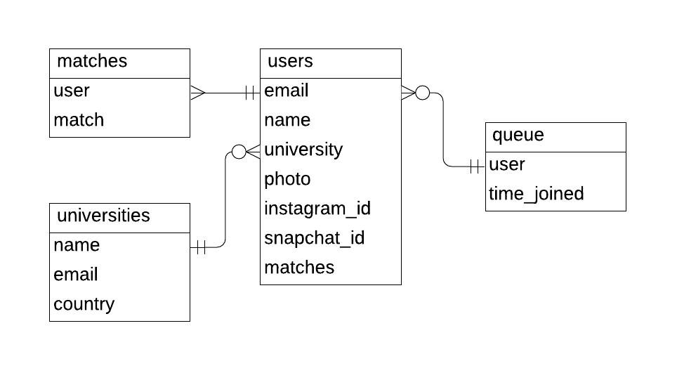

# videoserver
NodeJS and TypeScript based server for a video chat application. This app uses https://socket.io/ to handle data transmission and socket management
## Execution
1. Please ensure that you have npm installed
2. If you're running the project for the first time, first execute: ```npm i```
3. ```npm run dev```
## Testing
1. Run the application
2. Visit http://localhost:5000 on one tab - ensure that your webcam shows up
3. Visit the same page on another tab - you should see a socket ID pop up on the second tab
4. Click the socket ID on the second tab, to establish the connection with the socket in question (which is the one on the first page)
5. Talk to yourself during this time of social isolation :)))
## Database Design

